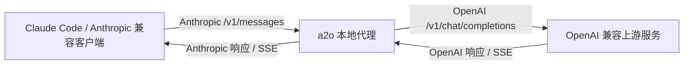

# a2o

Anthropic Messages API 到 OpenAI Chat Completions API 的本地代理。

a2o 让 Claude Code 和其他 Anthropic 兼容客户端，可以接入只支持 OpenAI `/v1/chat/completions` 的上游服务。它会在本地完成请求与响应格式转换，支持流式响应、工具调用、reasoning/thinking、图片输入和模型 ID 映射。

> Forked from [inlizard](https://git.ustc.edu.cn/largeoyos/ai/-/tree/main/shares/inlizard)。当前版本支持 Docker 部署和环境变量配置。

## 工作方式



适用场景：你的上游服务在 OpenAI Chat Completions 端点上有更好的路由、计费、缓存可观测性或兼容性，但客户端只能发 Anthropic `/v1/messages` 请求。

## 功能

| 功能 | 状态 |
|---|:---:|
| 非流式消息 | 支持 |
| 流式 SSE 消息 | 支持 |
| 工具调用：`tools`、`tool_use`、`tool_result` | 支持 |
| Reasoning / thinking blocks | 支持 |
| 图片输入：base64 和 URL | 支持 |
| `/v1/models` 代理与模型 ID 映射 | 支持 |
| 多上游服务与 round-robin 监听 | 支持 |
| 上游 HTTP 代理 | 支持 |
| 用量聚合到 `usage_stats.csv` | 支持 |

## 快速开始

使用 Docker 运行：

```bash
docker run -d --name a2o -p 9999:9999 \
  -e OPENAI_BASE_URL="https://your-api-service.com/v1/chat/completions" \
  -e OPENAI_API_KEY="sk-xxx" \
  -e AUTH_TOKEN="client-auth-key" \
  creationwong/a2o
```

让 Claude Code 指向 a2o：

```bash
export ANTHROPIC_BASE_URL=http://localhost:9999
export ANTHROPIC_AUTH_TOKEN=client-auth-key
```

验证代理：

```bash
curl -s http://localhost:9999/v1/messages \
  -H "x-api-key: client-auth-key" \
  -H "anthropic-version: 2023-06-01" \
  -H "content-type: application/json" \
  -d '{
    "model": "deepseek-chat",
    "max_tokens": 50,
    "messages": [{"role": "user", "content": "hi"}]
  }'
```

## 环境变量

| 变量 | 必填 | 默认值 | 说明 |
|---|:---:|---|---|
| `OPENAI_BASE_URL` | 是 | 空 | 上游 Chat Completions 地址，例如 `https://host/v1/chat/completions`。 |
| `OPENAI_API_KEY` | 是 | 空 | 发给上游的 API key，会作为 `Authorization: Bearer ...` 发送。 |
| `LISTEN_ADDRESS` | 否 | `9999` | 本地监听地址或端口。`9999` 和 `127.0.0.1:9999` 都可用。 |
| `AUTH_TOKEN` | 否 | 空 | a2o 客户端鉴权 token。为空时不启用客户端鉴权。 |
| `FORCE_MODEL` | 否 | 空 | 强制模型或模型 ID 映射。见 [模型映射](#模型映射)。 |
| `SERVICE_COMMENT` | 否 | `default` | `/v1/models` 返回中的 `owned_by` 供应商名，也是用量统计里的服务名。 |
| `DEBUG_LEVEL` | 否 | `info` | 设置为 `debug` 后输出请求头和缓存日志。 |
| `TIMEOUT_SECONDS` | 否 | `300` | 上游响应头超时时间。 |
| `UPSTREAM_PROXY` | 否 | 空 | 上游请求使用的 HTTP 代理地址。 |
| `ROUND_ROBIN_ADDRESS` | 否 | 空 | 额外启动一个 round-robin 监听端口，在多个 service 之间轮询。 |

### 模型映射

`FORCE_MODEL` 支持两种模式。

强制所有请求使用同一个上游模型：

```bash
FORCE_MODEL="deepseek-chat"
```

对外暴露一个下游模型 ID，但实际请求另一个上游模型 ID：

```bash
# 客户端看到并请求 "deepseek"，上游实际收到 "ds"。
FORCE_MODEL="ds:deepseek"
```

配置多个映射：

```bash
FORCE_MODEL="ds:deepseek,gpt-4o:openai"
```

显式映射效果：

| 客户端请求 | 上游请求 |
|---|---|
| `deepseek` | `ds` |
| `openai` | `gpt-4o` |

`GET /v1/models` 会使用同一套映射规则。a2o 会尽量请求上游 `/models`，把匹配到的上游模型 ID 改写成下游模型 ID，并过滤未映射模型，同时把 `owned_by` 设置为 `SERVICE_COMMENT`。如果上游模型列表不可用，但已经配置了显式映射，a2o 会直接返回配置中的映射模型列表。

## 端点

| 端点 | 鉴权 | 说明 |
|---|:---:|---|
| `POST /v1/messages` | 设置 `AUTH_TOKEN` 时需要 | 主代理端点，兼容 Anthropic Messages API。 |
| `GET /v1/models` | 设置 `AUTH_TOKEN` 时需要 | OpenAI 兼容模型列表，支持模型 ID 映射。 |
| `GET /models` | 设置 `AUTH_TOKEN` 时需要 | `/v1/models` 的别名。 |
| `GET /health` | 不需要 | 健康检查，返回 `OK`。 |
| `POST /v1/messages/count_tokens` | 不需要 | 粗略 token 估算，目前按请求 body 长度除以 4。 |

客户端鉴权支持两种 header：

```text
x-api-key: <AUTH_TOKEN>
Authorization: Bearer <AUTH_TOKEN>
```

## 配置文件

a2o 默认会读取 `config.json`，并且环境变量优先级高于配置文件。

单服务示例：

```json
{
  "debug_level": "info",
  "auth_token": "client-auth-key",
  "timeout_seconds": 300,
  "services": [
    {
      "comment": "deepseek",
      "listen_address": "9999",
      "openai_base_url": "https://your-api-service.com/v1/chat/completions",
      "openai_api_key": "sk-xxx",
      "force_model": "ds:deepseek"
    }
  ]
}
```

多服务 + round-robin 示例：

```json
{
  "auth_token": "client-auth-key",
  "round_robin_address": "9999",
  "services": [
    {
      "comment": "provider-a",
      "listen_address": "10001",
      "openai_base_url": "https://provider-a.example/v1/chat/completions",
      "openai_api_key": "sk-a",
      "force_model": "ds:deepseek"
    },
    {
      "comment": "provider-b",
      "listen_address": "10002",
      "openai_base_url": "https://provider-b.example/v1/chat/completions",
      "openai_api_key": "sk-b",
      "force_model": "gpt-4o:openai"
    }
  ]
}
```

指定自定义配置文件：

```bash
./a2o -config config.local.json
```

## 本地构建

当前仓库是一个简单 Go package，没有 `go.mod`。源代码和应用入口在 `src/`。

```bash
GO111MODULE=off go test ./src
GO111MODULE=off go build -o a2o ./src
```

Docker 构建：

```bash
docker build -t a2o .
```

## 项目结构

```text
.
├── src/           # a2o 源码、入口和测试
├── Dockerfile     # 多阶段镜像构建
├── README.md      # 使用说明
├── .dockerignore  # Docker 构建上下文忽略规则
└── .gitignore     # Git 忽略规则
```

## API 转换说明

### 请求转换

| Anthropic 字段 | OpenAI 输出 |
|---|---|
| `model` | `model`，会先应用可选的 `FORCE_MODEL` 映射。 |
| `system` | 第一条 `system` 消息；文本 block 会拼接。 |
| `messages[].role=user` | `user` 消息；`tool_result` 会转为独立 `tool` 消息。 |
| `messages[].role=assistant` | `assistant` 消息，包含文本、`reasoning_content` 和 `tool_calls`。 |
| `max_tokens` | `max_tokens`。 |
| `stop_sequences` | `stop`。 |
| `stream` | `stream`；流式请求会额外设置 `stream_options.include_usage=true`。 |
| `temperature`、`top_p` | 透传。 |
| `tools[]` | OpenAI function tools。 |
| `tool_choice` | 支持 `auto`、`required`、`none` 或指定 function tool。 |
| `metadata.user_id` | `user`。 |

### 响应转换

| OpenAI 字段 | Anthropic 输出 |
|---|---|
| `message.reasoning_content` | `thinking` content block。 |
| `message.content` | `text` content block。 |
| `message.tool_calls` | `tool_use` content blocks。 |
| `finish_reason=stop` | `stop_reason=end_turn`。 |
| `finish_reason=length` | `stop_reason=max_tokens`。 |
| `finish_reason=tool_calls` | `stop_reason=tool_use`。 |
| `usage.prompt_tokens` | `usage.input_tokens`。 |
| `usage.completion_tokens` | `usage.output_tokens`。 |

### 流式响应

OpenAI SSE chunk 会转换成 Anthropic SSE event：

| OpenAI 流式数据 | Anthropic 流式事件 |
|---|---|
| 第一段 chunk | `message_start` |
| `delta.content` | `content_block_delta`，类型为 `text_delta` |
| `delta.reasoning_content` | `content_block_delta`，类型为 `thinking_delta` |
| `delta.tool_calls` | `content_block_start`、`content_block_delta`、`content_block_stop` |
| 最终 usage chunk | `message_delta` usage |
| `[DONE]` | `message_stop` |

## 缓存日志

设置：

```bash
DEBUG_LEVEL=debug
```

a2o 会输出识别到的缓存命中信息：

```text
[deepseek-chat] Prefix Cache Hit: 50432 cached tokens (vLLM)
[9999] Cache Header: HIT
```

支持的缓存字段包括：

- vLLM：`usage.prompt_tokens_details.cached_tokens`
- DeepSeek 风格：`prompt_cache_hit_tokens`、`prompt_cache_miss_tokens`
- 磁盘缓存：`cache_read_input_tokens`
- 响应头：`X-DS-Cache-Hit`、`X-Cache`、`X-Cache-Status`、`CF-Cache-Status`

## 运行产物

a2o 会把每日聚合用量写到：

```text
usage_stats.csv
```

该 CSV 已在 `.gitignore` 中忽略。
